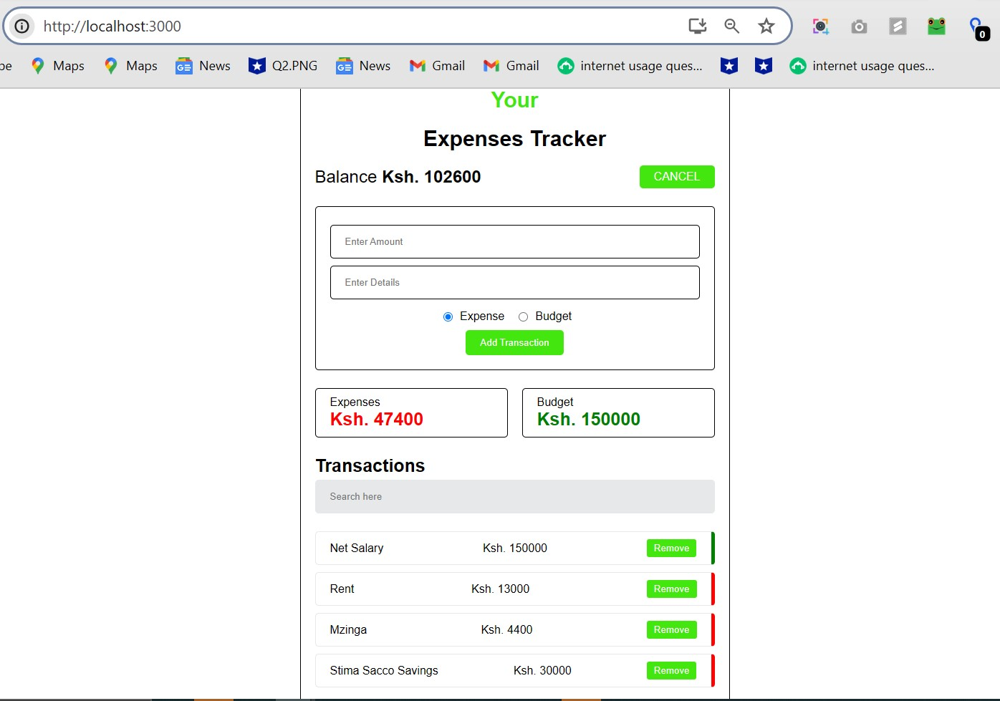

# Your Expenses Tracker

A simple and intuitive expense tracking application built with React.js.

## Features

- Track your expenses and budget
- Add new transactions (expenses or budget)
- View current balance
- List of recent transactions
- Remove transactions
- Search functionality

## Live Demo

[View the live application](https://your-expenses-tracker-in-reactjs-augastine-ndetis-projects.vercel.app/)

## Getting Started

1. Clone the repository
2. Install dependencies with `npm install`
3. Run the development server with `npm start`

## Technologies Used

- React.js
- CSS for styling

## Contributing

Contributions, issues, and feature requests are welcome. Feel free to check [issues page](https://github.com/MrBytes10/Your-Expenses-Tracker-in-React.Js/issues) if you want to contribute.

## License

This project is [MIT](https://choosealicense.com/licenses/mit/) licensed.
